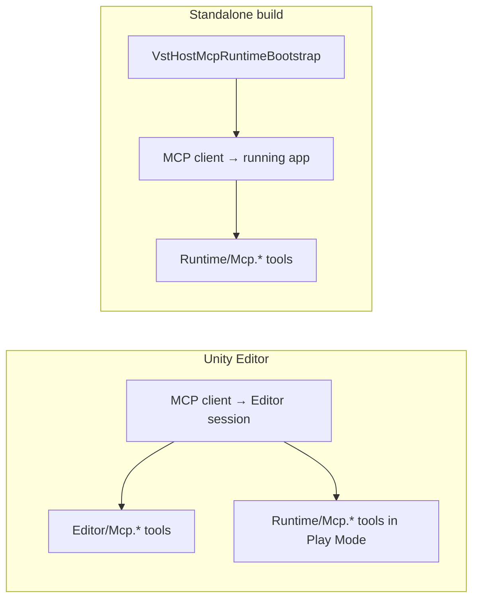

# Unity-MCP integration (optional)

Optional [Unity-MCP](https://github.com/IvanMurzak/Unity-MCP) tools let Cursor (and other MCP hosts) drive this package: scan / load / note / parameters / presets / Activity / Audio Graph, plus MIDI Plugin wiring when present.

**Unity-MCP is not bundled** with this package. Install it separately; without it, the MCP assemblies do not compile.

## Requirements

| Item | Value |
|------|-------|
| Unity-MCP | `com.ivanmurzak.unity.mcp` ≥ **0.76.0** (sets `FEATURE_UNITY_MCP` + `UNITY_MCP_READY` when NuGet deps resolve) |
| This package | `jp.kshoji.unity.vst3nativehost` (Git URL / local `file:`) |
| MIDI tools | Optional [Unity MIDI Plugin](https://assetstore.unity.com/packages/slug/198917) + `FEATURE_MIDI_PLUGIN` |

Custom tool conventions follow the Unity-MCP wiki:
[Custom Tools Development](https://github.com/IvanMurzak/Unity-MCP/wiki/Custom-Tools-Development).

## Layout

| Path | asmdef | When it compiles |
|------|--------|------------------|
| `Runtime/Mcp.Core/` | `…Mcp.Core` | Always (shared MCP helpers) |
| `Runtime/Mcp/` | `…Mcp.Runtime` | Unity-MCP ready; **Standalone + Editor Play Mode** |
| `Runtime/Mcp.Midi/` | `…Mcp.Midi.Runtime` | Unity-MCP + `FEATURE_MIDI_PLUGIN` (wiring tools) |
| `Runtime/Mcp.Timeline/` | `…Mcp.Timeline.Runtime` | Unity-MCP + Timeline (director control) |
| `Runtime/Mcp.InputSystem/` | `…Mcp.InputSystem.Runtime` | Unity-MCP + Input System |
| `Runtime/Mcp.ScriptableAudio/` | `…Mcp.ScriptableAudio.Runtime` | Unity 6000.3+ non-WebGL |
| `Runtime/Mcp.ScriptableAudio.Midi/` | `…Mcp.ScriptableAudio.Midi.Runtime` | SA + MIDI defines |
| `Runtime/Mcp.Midi.Chunity/` | `…Mcp.Midi.Chunity.Runtime` | MIDI + Chunity |
| `Runtime/Mcp.Midi.Network/` | `…Mcp.Midi.Network.Runtime` | MIDI + Network MIDI |
| `Editor/Mcp/` | `…Mcp` | **Editor-only** (settings, verify, preset asset, VS register, …) |
| `Editor/Mcp.Midi/` | `…Mcp.Midi` | **Editor-only** CC mapping asset CRUD / learn |
| `Editor/Mcp.Timeline/` | `…Mcp.Timeline` | **Editor-only** TimelineAsset creation |

Runtime assemblies never reference Unity-MCP Editor code. Host control, graph, presets (runtime), and optional wiring live in **`Runtime/Mcp*.Runtime`**; asset creation and Project Settings stay in **`Editor/Mcp.*`**. Standalone builds opt in via `VstHostRuntimeMcpConfig` (Resources) and `VstHostMcpRuntimeBootstrap`, which registers all loaded `*.Mcp.*.Runtime` assemblies. Missing optional packages omit those tools from `tools/list`.

### Editor-only vs Runtime (summary)

| Editor only | Runtime + Editor Play Mode |
|-------------|----------------------------|
| `settings-get/set`, `verify-platforms`, `sync-midi-define` | `host-*`, scan/load, params, MIDI send, graph, activity |
| `preset-create-asset`, `parameter-panel-setup`, `animator-setup`, `vs-register` | `preset-capture/apply/list/ab` (Resources path in builds) |
| `timeline-param-track`, `timeline-program-marker` | `timeline-director-control` |
| `cc-mapping-create/list/edit`, `midi-learn` | `midi-adapter-setup`, `smf-link`, `channel-routes`, `filter-link`, `route-sync` |
| | `inputsystem-bridge`, `sa-generator-setup`, `sa-midi-bridge`, Chunity / Network links |

| Export Runtime MCP Config to Resources | Copies Project Settings scan prefs → `Resources/VstHostRuntimeMcpConfig.asset` |

## Runtime MCP (Standalone builds)

Unity-MCP exposes **two connection targets** in a typical workflow:

| Connection | When | Tools registered |
|------------|------|------------------|
| **Editor** | Unity Editor open | Runtime `vst3-*` (Play Mode) **plus** Editor-only tools |
| **Runtime / build** | Standalone executable running | Runtime `vst3-*` only (no asset creation, settings, verify) |

When `VstHostRuntimeMcpConfig.mcpEnabled` is true, `VstHostMcpRuntimeBootstrap` starts **UnityMcpPluginRuntime** after scene load and registers every loaded `jp.kshoji.unity.vst3nativehost.Mcp.*.Runtime` assembly. Default is **off** — enable explicitly before shipping builds that expose MCP.

### Runtime configuration

| Field | Purpose |
|-------|---------|
| `mcpEnabled` | Master switch; when false, no MCP connection is started |
| `host` | MCP server URL (e.g. `http://localhost:8080`) |
| `token` | Bearer token — **required** when `mcpEnabled` is true (empty token blocks Bootstrap connect) |
| `autoInitializeHostOnStart` | Calls host init from audio settings after connect |
| `extraScanFolders` | Extra absolute `.vst3` paths; **`vst3-scan` merges these** after OS-standard folders |
| `preferredPluginNameContains` | Hint for auto-load helpers |

**Placement:** `Assets/Resources/VstHostRuntimeMcpConfig.asset` (Create → VST3 Host → Runtime MCP Config), or **Window → VST3 Host → Export Runtime MCP Config to Resources** / Project Settings → VST3 Host to copy scan folders from Project Settings.

Project Settings (`vst3-settings-get/set`) apply to the **Editor only**. Standalone reads `VstHostRuntimeMcpConfig` and resource `vst3://settings`.

### Workflow: author in Editor, control in build

1. In Editor: wire scene components (AudioFilter, Graph, MIDI adapter, Timeline Director, Input actions, presets under Resources).
2. Export runtime MCP config; set `mcpEnabled` and `token` for builds that need remote control.
3. Build Desktop Standalone; start MCP server; connect client to the **running app** (not the Editor session).
4. Call `vst3-features-status` → `vst3-host-init` (if not auto-init) → `vst3-scan` / `vst3-load` → `vst3-note-on` / `vst3-param-set` / graph tools.

Editor-only steps (mapping asset CRUD, Timeline track creation, VS register, verify) stay in the Editor; the build uses **pre-placed** assets and scene references.

### Security

- Runtime MCP is **opt-in** (`mcpEnabled = false` by default).
- Use a **non-empty token** when enabling; Bootstrap refuses to connect if the token is empty. Treat it like an API key.
- Prefer **localhost** binding on the MCP server; exposing MCP on a LAN or WAN increases remote-control risk for host load, parameters, and MIDI injection.
- Desktop Standalone only (same platform bounds as VST3 native). WebGL / mobile targets exclude Runtime MCP assemblies.

### Quick start (Standalone)

1. Install Unity-MCP in the project (≥ 0.76.0).
2. Create or export `Resources/VstHostRuntimeMcpConfig.asset`; set `mcpEnabled`, `host`, `token`; optional `autoInitializeHostOnStart`.
3. Add audio path (sample scene or `VstHostAudioFilter` + listener).
4. Build **Windows / macOS / Linux Standalone**; launch with MCP server running.
5. Connect MCP client to the **build** session.
6. `vst3-features-status` → `vst3-host-status` → `vst3-host-init` (if needed) → `vst3-scan` → `vst3-load` → `vst3-note-on` → **`vst3-note-off-all`**.

Manual matrix: [verification.md](verification.md#runtime-mcp-standalone).

## Quick start (Editor)

## Edit Mode vs Play Mode

| Kind | Examples | Behavior |
|------|----------|----------|
| Edit Mode OK | `features-status`, `host-status`, scan/settings/list (when Description says so) | Normal success |
| Play Mode required | note / MIDI1 send / AudioFilter setup / Process-backed paths | `[Error] {toolId} requires Play Mode...` |
| Host uninitialized | load / note / params | `[Error] {toolId} requires an initialized VST host...` |

## Tool groups (prefix `vst3-`)

### Core host

`features-status` · `host-status` · `host-init` / `host-terminate` · `scan` / `scan-folder` / `default-scan-folders` · `settings-get` / `settings-set` · `load` / `unload` / `list-instances` · `setup-audio-filter` / `audio-filter-detach` · `note-on` / `note-off` / `note-off-all` · `send-cc` / `send-pc` / `send-pitch` / `send-aftertouch` / `send-midi1` · `verify-platforms` · `activity-read` / `activity-clear` / `activity-enable` · `diagnostics-read` · `sync-midi-define` · `event-sink-setup` · `animator-setup` · `dsp-midi-schedule` · `vs-register`

### Parameters / presets

`params-list` · `param-get` / `param-set` · `programs-list` / `set-program` · `state-get` / `state-set` · `preset-create-asset` / `preset-capture` / `preset-apply` / `preset-list` / `preset-ab` · `parameter-panel-setup`

### MIDI Plugin wiring

**Runtime:** `midi-adapter-setup` · `smf-link` · `channel-routes` · `filter-link` · `route-sync`

**Editor only:** `cc-mapping-create` / `list` / `edit` · `midi-learn`

Device I/O, inject, and SMF transport stay on MIDI MCP (`midi-*` / `smf-*`). These tools only wire Adapter / SmfLink / mappings to the VST host.

### Audio Graph

`graph-status` · `graph-clear` · `graph-build-parallel` / `serial` / `send` / `sidechain` · `graph-set` / `graph-connect` · `graph-bypass` · `graph-set-node-gain` / `graph-set-edge-gain` · `graph-channel-routes` · `graph-arm`

Prefer **Build\*** helpers over raw `graph-set`.

### Optional integrations

| Tools | Condition |
|-------|-----------|
| `timeline-director-control` | Timeline (Runtime — play/pause/stop/time on scene Director) |
| `timeline-param-track` / `program-marker` | Timeline (**Editor only** — creates `.playable` assets) |
| `inputsystem-bridge` | Input System (Resources / scene `InputActionAsset`) |
| `sa-generator-setup` | Scriptable Audio (Unity 6000.3+) |
| `sa-midi-bridge` | SA + MIDI |
| `chuck-effect` / `chuck-event-midi-link` | Chunity |
| `network-midi-link` | Network MIDI |

## Resources

| Resources | `vst3://features`, `scanned`, `instances`, `activity/recent`, `diagnostics`, `settings`, `params/{pluginId}`, `graph/{object}` (**Mcp.Runtime**)

## Boundary with Unity MIDI Plugin MCP

| MIDI MCP | This package |
|----------|--------------|
| `midi-init` / devices / send / monitor / virtual inject | Adapter input path verification |
| `smf-player-control` | `vst3-smf-link` wires output |
| Docs / `midi-features-status` detection | All `vst3-*` host tools |

Do not implement `vst3-*` inside the MIDI package.

## Editor menu ↔ tools

| Window → VST3 Host | MCP |
|--------------------|-----|
| Plugin Browser | `vst3-scan` / `load` / note / `settings-*` |
| Preset Browser | `vst3-preset-*` / `programs-*` / `preset-ab` |
| Activity Monitor | `vst3-activity-read` / `enable` |
| Audio Graph | `vst3-graph-status` / `build-*` / bypass / gain |
| Virtual Controller | `vst3-note-*` / `send-cc` / `note-off-all` |
| Sync MIDI Plugin Define | `vst3-sync-midi-define` |
| Export Runtime MCP Config to Resources | (menu only — creates/updates Resources asset) |
| Verify Plugin Platforms | `vst3-verify-platforms` |
| Visual Scripting / Register Nodes | `vst3-vs-register` |
| Project Settings → VST3 Host | `vst3-settings-get` / `set` |

## Verification

Platform / MIDI ON-OFF / IL2CPP checks follow the existing matrix in
[verification.md](verification.md). MCP does not replace Standalone Build Verify;
use `vst3-verify-platforms` (Editor only) plus manual or CI verify menus as today.

Runtime MCP Standalone checks: [verification.md — Runtime MCP](verification.md#runtime-mcp-standalone).

## Out of scope

- Plugin-native GUI (`IPlugView`)
- Bundling Unity-MCP or third-party `.vst3`
- Calling native `Process` from the audio thread via MCP (MainThread host API / components only)
- Implementing `vst3-*` inside Unity MIDI Plugin
